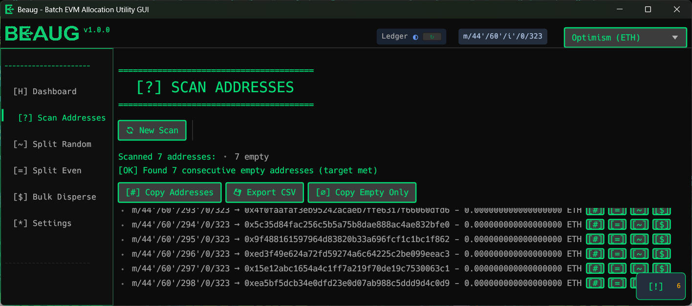

# B.E.A.U.G. - **Batch EVM Allocation Utility GUI**

[](https://opensource.org/licenses/MIT)
[](https://www.rust-lang.org/)
[](https://github.com/schbz/beaug)
[](https://github.com/schbz/beaug/stargazers)
[](https://github.com/schbz/beaug/issues)
[](https://github.com/schbz/beaug/commits/main)

*Pronounced "Boog" --  like "book" but with a soft "g"*

Beaug is a desktop application for managing hardware wallet accounts and transactions on multiple EVM networks. This tool specializes in easy bulk scanning of 'hierarchical deterministic' (HD) wallet derivation path addresses and one-to-many balance distribution through an intuitive retro-styled desktop interface.

<p align="center">
  
</p>

## Why I Made This

A few years back, I received a couple of airdrops on Ethereum and L2 networks that helped me out during a period of unemployment. This application is my way of giving back to the community by demonstrating some convenient UI features that I've long felt are missing from existing cryptocurrency wallets. Also this seemed like it would be a good choice for my first public Rust project. 

---

## 📖 Table of Contents

- [Quick Start](#-quick-start)
- [Potential Use Cases](#-potential-use-cases)
- [Disclaimer](#️-disclaimer)
- [Features](#-features)
- [Platform Compatibility](#-platform-compatibility)
- [Prerequisites](#-prerequisites)
- [Download](#-download)
- [Installation](#️-installation)
- [Usage](#-usage)
- [Architecture](#-architecture)
- [Configuration](#️-configuration)
- [Bulk Disperse Contract](#-beaug-bulk-disperse-contract-version-100)
- [Security](#-security)
- [Acknowledgments](#-acknowledgments)
- [Contributing](#-contributing)

---

## ⚡ Quick Start

```bash
git clone https://github.com/schbz/beaug.git && cd beaug
cargo build --release
./target/release/beaug      # Unix/macOS
.\target\release\beaug.exe  # Windows
```

Connect your Ledger with the Ethereum app open, and you're ready to go!

---

## 🎯 Potential Use Cases


- **Local Network Bootstrapping** — Rapidly distribute funds across many addresses when setting up private testnets, local nodes, or development environments
- **Smart Contract Testing** — Prepare multiple wallets with specific balances to simulate real-world user interactions, stress test gas limits, or verify multi-party contract logic
- **Derivation Path Exploration** — Gain hands-on familiarity with BIP44 derivation path notation
- **Address Auditing** — Discover forgotten or dormant addresses within your derivation paths that may still hold funds
- **Batch Fund Distribution** — Conveniently allocate funds to multiple recipients (team payments, grants, bounties) in minimal transactions
- **Multi-Chain Operations** — Rapidly switch between EVM networks to replicate the same operations across multiple chains


## ⚠️ DISCLAIMER

> **THIS SOFTWARE IS PROVIDED FOR EXPERIMENTATION AND EDUCATIONAL PURPOSES ONLY.**
>
> - This application is experimental and under active development
> - **DO NOT** use this software with significant funds or on mainnet without thorough testing
> - Default/public RPC endpoints may be run by third parties and can be unreliable, rate-limited, or log metadata; use your own trusted RPC when possible
> - The developer assumes **NO LIABILITY** for any loss of funds, security breaches, or damages
> - contract-based operations require **blind signing** — which is something you want to be very careful about
> - Use at your own risk, and always compile from source if you can

---

## 📋 Features

### Implemented


- [x] **Address Management** - Derive and manage hundreds of addresses from BIP44 paths
- [x] **Balance Scanning** - Batch check balances with automatic empty address detection
- [x] **Batch Fund Distribution**
  - [x] Even Split - Distribute funds evenly across recipient addresses
  - [x] Random Split - Distribute funds in randomized amounts
  - [x] Bulk Disperse - Use smart contracts for efficient one-to-many transfers
- [x] **Multi-Network Support** - Configure and switch between EVM networks
- [x] **Custom Networks** - Add custom RPC endpoints and chain configurations
- [x] **Transaction Management** - Real-time queue with status tracking, retry, and skip
- [x] **Settings Persistence** - User preferences saved locally
- [x] **Derivation Path Options** - Support for multiple derivation path formats
- [x] **Gas Price Controls** - Adjustable gas speed multiplier (0.8x - 2.5x)
- [x] **Native Ledger Support** - Direct HID communication with Ledger devices (no external tools required)
- [x] **Backup Cast Mode** - Optional Foundry `cast` CLI fallback if needed
- [x] **Operation Logging** - Local logs for operational history, with in-app viewing

### Possible Future Features (community interest unlocks these!)

- [ ] **Better multi-platform support** - Support for more platforms than just Windows.
- [ ] **Support for alternate hardware wallets** - Support for hardware wallets other than Ledger
- [ ] **ETH domain name support** - Support for ENS domain names instead of addresses
- [ ] **ERC-20 Token Support** - Token transfers in addition to native currency
- [ ] **Expanded Contract-based functionality** - custom routers, time-based dispersals, etc.

---

## 💻 Platform Compatibility

| Platform | Status | Notes |
|----------|--------|-------|
| Windows 10/11 | ✅ Tested | Fully functional |
| macOS | 🚧 Untested | Should work, needs testing |
| Linux | 🚧 Untested | May need udev rules for Ledger access |

### Platform Notes

- **Windows**: No additional drivers or software needed
- **macOS**: May require allowing the app in Security & Privacy settings
- **Linux**: May require [udev rules](https://support.ledger.com/article/115005165269-zd) for Ledger device access

---

## 📦 Prerequisites

### Required

| Dependency | Version | Purpose |
|------------|---------|---------|
| **Rust** | 1.70+ | Build from source |
| **Ledger Device** | Nano X/S+ | Hardware wallet for signing |
| **RPC Endpoint** | — | Access to an EVM node (public or private) |

### Hardware Setup

- **Ledger Nano X or Nano S+** connected via USB
- Device must be **unlocked** with the **Ethereum app open**
- For contract interactions, **blind signing** may need to be enabled in Ledger settings

### Optional: Foundry Cast (Backup Mode)

Beaug uses native HID communication with your Ledger by default — no external software required. However, if you experience issues, you can switch to Foundry's `cast` CLI as a backup in Settings.

<details>
<summary>Installing Foundry (only if using Cast backup mode)</summary>

```bash
# Unix/macOS/WSL
curl -L https://foundry.paradigm.xyz | bash
foundryup

# Verify installation
cast --version
```

**Windows (without WSL):**
1. Download from [Foundry Releases](https://github.com/foundry-rs/foundry/releases)
2. Extract `cast.exe` to your PATH or place it alongside `beaug.exe`

</details>

---

## 📥 Download

Pre-built binaries coming soon, maybe? For now, please [build from source](#️-installation).

---

## 🛠️ Installation

### Build from Source

```bash
# Clone the repository
git clone https://github.com/schbz/beaug.git
cd beaug

# Build release version
cargo build --release

# Run the application
./target/release/beaug      # Unix/macOS
.\target\release\beaug.exe  # Windows
```

### Development Build

```bash
cargo run
```

### Running Tests

```bash
# Run all tests
cargo test

# Run tests for a specific module
cargo test config::tests
cargo test user_settings::tests
cargo test utils::tests
cargo test gui::helpers::tests

# Run tests with output displayed
cargo test -- --nocapture
```

Tests are organized as inline `#[cfg(test)]` modules within each source file. This keeps tests close to the code they verify and makes it easy to run targeted test suites.

---

## 🚀 Usage

1. **Connect Ledger**: Connect your device, unlock it, and open the Ethereum app
2. **Launch Application**: Run the executable to open the GUI
3. **Configure Network**: Select your target network or configure a custom RPC
4. **Scan Addresses**: Discover your derived addresses and their balances
5. **Perform Operations**: Use Split Even, Split Random, or Bulk Disperse to distribute funds

---

## 📁 Architecture

```
src/
├── main.rs                    # Application entry point
├── lib.rs                     # Library exports
├── gui/                       # GUI module (eframe/egui)
│   ├── mod.rs                 # Module entry point and re-exports
│   ├── app.rs                 # Main GuiApp struct and implementation
│   ├── async_job.rs           # Generic async job polling
│   ├── theme.rs               # Centralized theming and styling
│   ├── helpers.rs             # Gas calculations, formatting utilities
│   ├── notifications.rs       # Notification system
│   ├── views/                 # View modules (screen rendering)
│   │   ├── mod.rs
│   │   ├── dashboard.rs
│   │   ├── settings.rs
│   │   ├── split.rs
│   │   ├── disperse.rs
│   │   └── balances.rs
│   └── widgets/               # Reusable GUI widgets/components
│       ├── mod.rs
│       └── transaction_view.rs  # Transaction queue UI widget
├── config.rs                  # Configuration management
├── user_settings.rs           # Persistent user settings
├── native_ledger.rs           # Native Ledger HID communication (default)
├── ledger_dispatch.rs         # Routes between native/cast backends
├── ledger_ops.rs              # Ledger device operations & cast path finder
├── ethers_ledger_signer.rs    # Ledger signing via cast CLI (backup)
├── ledger_transaction_manager.rs  # Transaction manager with retry logic
├── ledger_lock.rs             # Ledger access synchronization
├── balance.rs                 # Balance scanning utilities
├── split_operations.rs        # Fund splitting logic (equal/random)
├── bulk_disperse.rs           # Bulk disperse via smart contracts
├── disperse.rs                # Disperse contract interface
├── transaction_queue.rs       # Transaction state management
├── types.rs                   # Shared type definitions
├── operation_log.rs           # Operation logging
└── utils.rs                   # Helper functions
```

---

## ⚙️ Configuration

Settings are stored in your system's configuration directory:

| Platform | Location |
|----------|----------|
| Windows | `%APPDATA%\beaug\beaug_settings.json` |
| macOS | `~/Library/Application Support/beaug/beaug_settings.json` |
| Linux | `~/.config/beaug/beaug_settings.json` |

### Configurable Options

- Default source address index
- Recipient count for splits
- Remaining balance after operations
- Gas speed multiplier (0.8x - 2.5x)
- Custom derivation paths (Account-index, Address-index)
- Network-specific settings
- Custom network definitions
- Ledger connection method (Native / Cast backup)

---

## 📜 Beaug Bulk Disperse Contract Version 1.0.0

The 'Bulk Disperse' feature uses a purpose-built solidity contract to send funds to many recipients efficiently (one transaction instead of many). Most contract implementation details and audits (if/when available) will be maintained in a separate repository to keep this repo focused on the desktop application.

### Contract Address

```
0xe7deb73d0661aa3732c971ab3d583cfca786e0d7
```

### Deployed Networks

| Network | Chain ID |
|---------|----------|
| Ethereum | 1 |
| Optimism | 10 |
| Base | 8453 |
| Polygon | 137 |
| BNB Smart Chain | 56 |
| Avalanche C-Chain | 43114 |
| Linea | 59144 |
| Gnosis Chain | 100 |
| Celo | 42220 |
| Pulsechain | 369 |
| Ethereum Classic | 61 |
| Sepolia (testnet) | 11155111 |

### Features

- **Gas-efficient batch transfers** - Send ETH to many recipients in a single transaction
- **Proof of dispersal** - Each dispersal emits a unique `dispersalId` and `recipientsHash` for on-chain verification
- **Two-step ownership** - Safe ownership transfers requiring explicit acceptance
- **Contract registry** - Discover other Beaug-compatible disperse contracts
- **Stuck fund recovery** - Owner can withdraw ETH sent directly to the contract by mistake

### Events and Use Cases

The `BeaugDispersed` event emits:
- `sender` - Address that initiated the dispersal
- `dispersalId` - Unique sequential ID for this dispersal
- `totalDistributed` - Total ETH amount sent
- `recipientCount` - Number of recipients
- `recipientsHash` - keccak256 hash of recipients array

**Potential applications:**
- **Proof of Dispersal** - Verify specific addresses received funds by matching `recipientsHash`
- **On-chain attestations** - Demonstrate distribution patterns to many addresses
- **Airdrop eligibility** - Track "dust" dispersals where amounts are smaller than fees (burn-like behavior)

---

## 🔒 Security

If you discover a security vulnerability, please **do not** open a public issue. Instead, use GitHub's [private vulnerability reporting](https://github.com/schbz/beaug/security/advisories/new) feature.

---

## 🙏 Acknowledgments

Built with:
- [egui](https://github.com/emilk/egui) — Immediate mode GUI framework
- [ethers-rs](https://github.com/gakonst/ethers-rs) — Ethereum library for Rust
- [Foundry](https://github.com/foundry-rs/foundry) — Optional cast CLI support

---

## 🤝 Contributing

Contributions are welcome! Please open an issue or submit a pull request.
